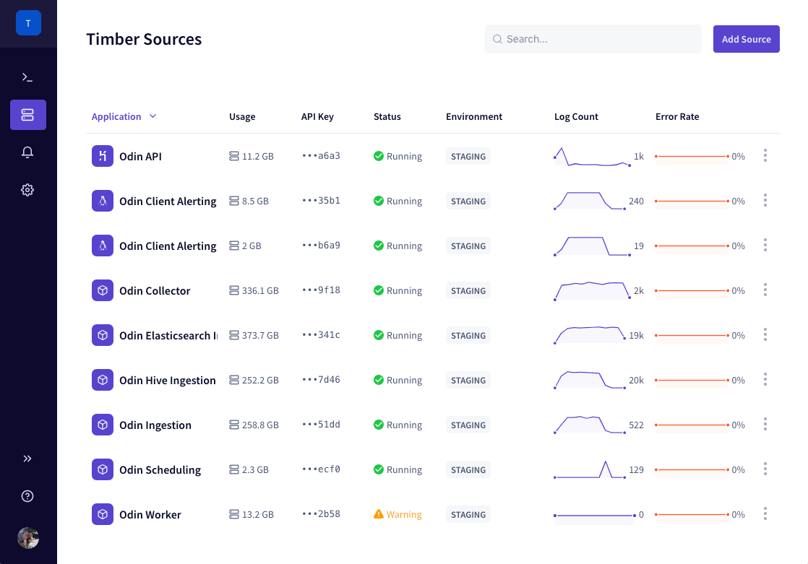

# What Is Timber?

[Timber](https://timber.io/) is a hosted service for aggregating logs across your entire stack - [any language](setup/languages/), [any platform](setup/platforms/), [any data source](setup/log-forwarders/). Timber was designed with a strong focus on simplicity, real-time log access, and providing a high-quality developer experience. Key features of Timber include:

* **Automatic Context** - All Timber integrations [capture context to improve your logs](under-the-hood/integration-philosophy.md#automatic-context-capturing).
* **Deep Language Integration** - Unmatched [language runtime integrations](setup/languages/).
* **Low Configuration** - Immediately useful, start using Timber within minutes.
* **Built For Structured Logging** - [Dynamic Schemas](under-the-hood/schema-maintenance.md), [Live Tailing](usage/live-tailing.md),  [SQL Querying](usage/sql-querying.md), and more.
* **Sub-Second Live Tail** - Logs are available, in real-time, through our [live-tail](usage/live-tailing.md).

