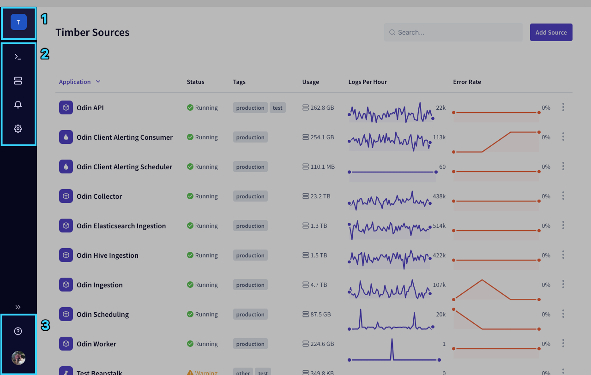
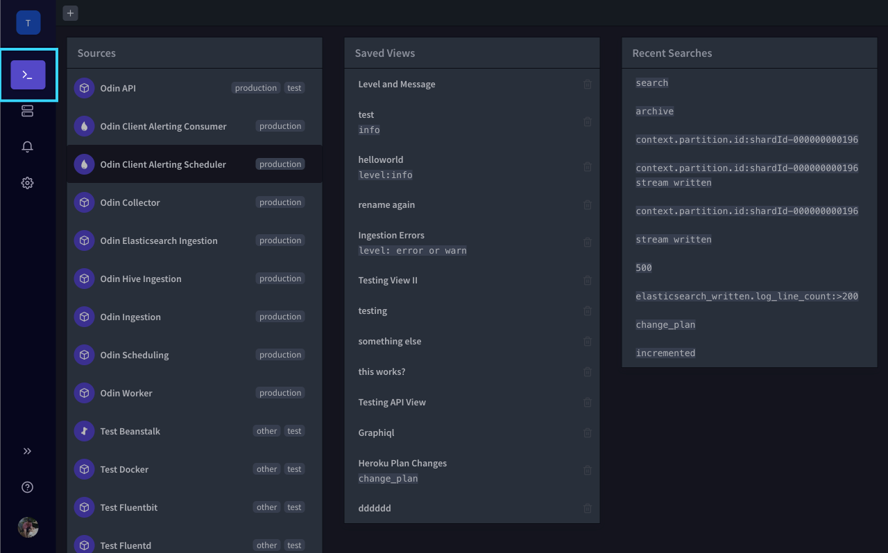
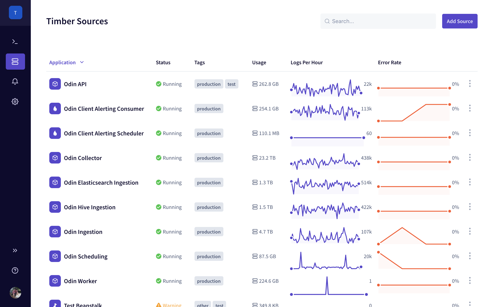

# Web App

Use Timber within any modern browser.

## Accessing

In your browser, navigate to [**https://app.timber.io**](https://app.timber.io).

## Layout

### 1. Organization Switcher

Easily switch between and manage multiple organizations.

### 2. Main Navigation

Contains the [main sections](./#sections) of the apps.

### 3. Account & Help

Account preferences, sign out, and get help.

## The Console

The console is the the first icon in the [main navigation](./#2-main-navigation). It is the main area where you'll explore your logs. It's comprised of views that serve as windows into your data. These are represented by tabs.

### Live Tail View

The [live-tail view](../../usage/live-tailing.md) is designed to give you real-time access into your log data with powerful search capabilities. Learn more in our [live-tail section](../../usage/live-tailing.md).

### Graph View

The [_graphing view_](../../usage/graphing.md) lets you visualize your log data. Learn more in our [graphing section](../../usage/graphing.md).

## Sources

The [sources section](../../usage/source-management.md) lets you [manage your log sources](../../usage/source-management.md).

## Alerts

The [alerts section](../../usage/alerting.md) let you manage all of your alerts and notification preferences.

## Settings

The [settings section](../../usage/account-management/) lets you manage all of your organization settings.

## Usage









...and more. Checkout out the [main usage section](../../usage/live-tailing.md) for more guides and tutorials.

