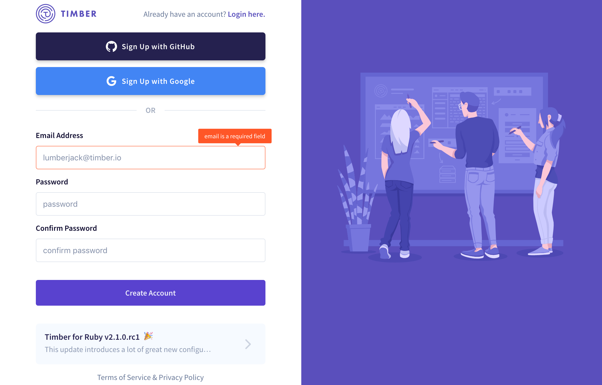
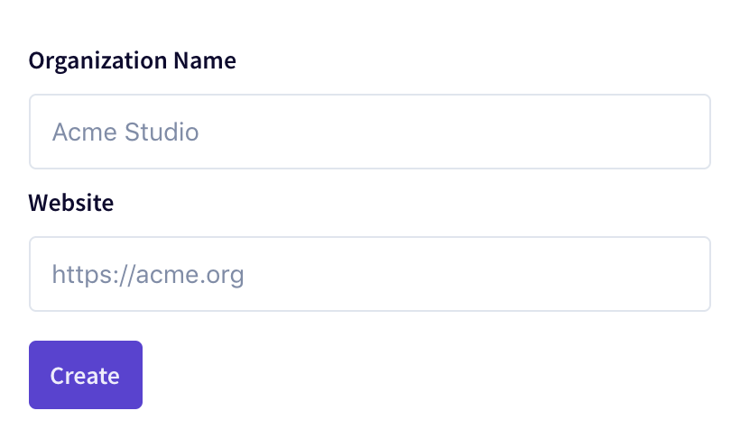

# Getting Started

## 1. Create An Account

Navigate to the [Timber app](https://app.timber.io) to create an account. You can either signup with a social integration, such as Github or Google, or create a Timber specific account.

## 2. Create An Organization

Once logged in, the first think you'll need to do is create an [organization](under-the-hood/concepts.md#organization). An organization is the highest organizational unit within Timber. It is a workspace that contains members, log sources, and more. Your chosen organization name will also serve as your URL slug.

## 3. Create A Source

After creating an organization you'll want to add your first log [source](under-the-hood/concepts.md#source). A source is simply a container for log data; you can create as many of these as you desire. Your log sources should reflect your 

## 4. View Your Log Data

## 5. Next Steps

fsdf

