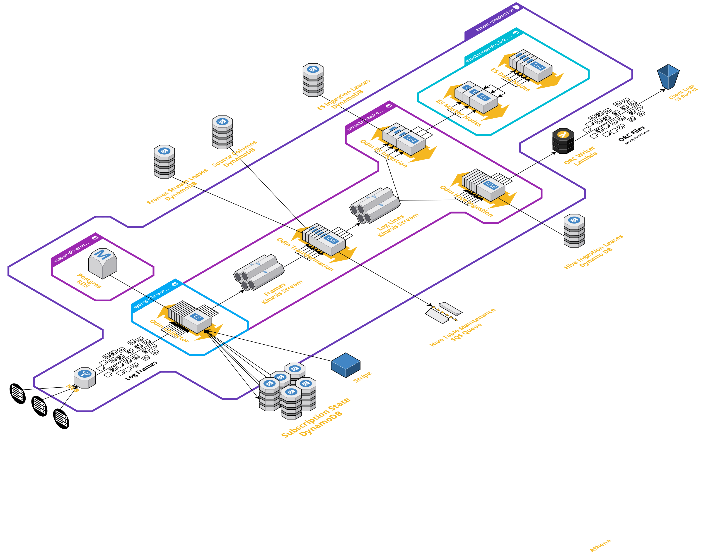

# Ingestion Pipeline

As developers ourselves, we always have more confidence in systems that are transparent with their architecture since it helps to build confidence in the system. The purpose of this document is to give you a peek under the hood and do exactly that.

## Architecture

Let's start with a high-level architectural diagram of Timber's ingestion pipeline:

As you can see, the Timber ingestion pipeline is compromised of multiple systems. This document will not get into the intricate details of each, but instead will focus on how we persist and search your log data.

## Elasticsearch / S3 Hybrid Storage Engine

A unique architectural aspect of Timber is our Hybrid [Elasticsearch](https://www.elastic.co/products/elasticsearch) / [S3](https://aws.amazon.com/s3/) storage engine. We offset Elasticsearch's weaknesses with the strengths of S3 and vice-versa. This is what enables Timber to offer the incredibly high durability, longer retentions, faster search speeds, and competitive pricing. Let's go through each point individually:

### Improved Durability

All log data sent to Timber is written to S3 in addition to Elasticsearch. S3 has [impressively high durability](https://docs.aws.amazon.com/AmazonS3/latest/dev/DataDurability.html) \(11-9s\) which is passed onto to you since your log data lives there. It's important to note that these are not cold archives of your log data, but indexed queryable data that is immediately available \(more on this below\).

### Improved Reliability & Natural Failover

A inherent benefit of this architecture is the natural failover. If Elasticsearch was to fail, Timber's query engine falls back to S3 for the data that woud otherwise be on Elasticsearch. Given Elasticsearch's relative reduced reliability this helps to ensure Timber is available when you need it most.

### Longer Retentions

Because we use S3 we are able to much more efficiently retain data for longer periods. This benefit is passed onto our customers. We don't pay for active running servers to persist data, we simply pay the S3 storage prices and pay when we query it. For example, we have many customers that retain over 12 months of searchable data without issue. This is why our pricing plans offer customizable retention for little cost difference.

### Faster Query Speeds

Timber's fast query speeds are very much a result of this architectural decision for a few reasons:

1. We're able to aggressively tune Elasticsearch for performance. Because of our S3 backbone Elasticsearch can fail without consequence. This allows us to take risks that improve the performance of Elasticsearch.
2. We only hold the last 24 hours of data on Elasticsearch. This also allows us to more aggressively tune Elasticsearch towards performance while capping the total cost an individual query can have on the cluster.
3. We use [Amazon's Athena service](https://aws.amazon.com/athena/) to query data on S3. Athena is an on-demand distributed query engine that uses thousands of CPU cores to efficiently search data on S3.

### ANSI Compliant SQL Querying

Because Timber uses Presto / Athena to query data on S3 you get [full ANSI compliant SQL query capabilities](../usage/sql-querying.md). There is no limited proprietary query language to learn.

### Affordability

This architecture is also cheaper, and we pass those costs saving onto our competitors. This is why our pricing is generally much cheaper than our competition. And as we improve we plan to pass those cost saving onto our customers.

