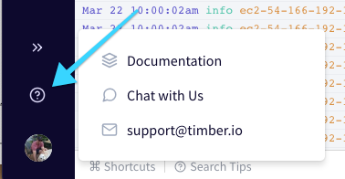

# Support

Timber prides itself in the user experience we deliver and support play a big part in that. This document will cover support, how it works, and what you can expect.

## Contacting Support

### From Within The App

We prefer that you contact us from within the Timber app, if possible. This lets us collect useful information about your account so that we can assist your faster and better. Just click the "?" icon in the bottom left:

### By Email

You can contact support by email via support@timber.io. Please include any relevant information about your account so that we can assist you faster.

## Free Plan Limitations

In order to ensure high-quality support for paying customers we must limit support for non-paying customers. The time it takes to respond is dependent on the complexity of your question and the resources available at the time. While it is our goal to help every user of Timber, we have limited resources, and cannot meet the quality of support we would expect without limiting support for free plans. If support is critical or important to you then we kindly ask that you [upgrade your plan](../usage/account-management/billing.md#changing-plans).

