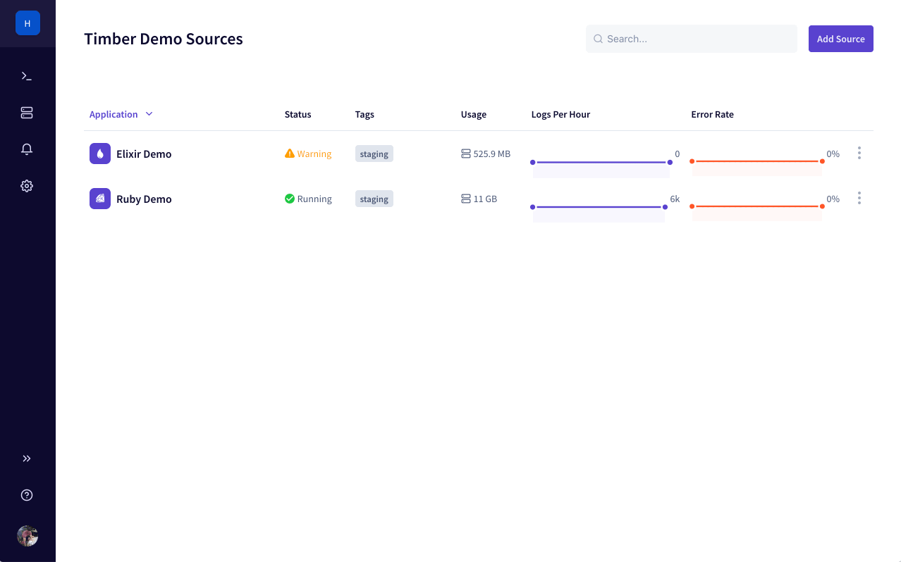

# Team Management

Easily manage who has access to your organization and it's resources.


You must have [`admin` permissions](role-based-access-control.md) to manage your organization's teams.


## Getting Started

1. [Open the Timber web app](https://app.timber.io).
2. Navigate to the [S](../../clients/web-app/#the-console)ettings section using the [main navigation](../../clients/web-app/#2-main-navigation).
3. Click on the "Manage Team" tab.

## Usage

### Inviting

Adding a team member requires that you send them an invitation. This allows the user to setup their account theirselves, choosing their authentication method and any other account details.

1. [Open the Timber web app](https://app.timber.io).
2. Navigate to the [S](../../clients/web-app/#the-console)ettings section using the [main navigation](../../clients/web-app/#2-main-navigation).
3. Click on the "Manage Team" tab.
4. Click the "Invite Members" button.
5. Enter your team member's email and select the [appropriate role](role-based-access-control.md).
6. An invitation will be sent to that email address, they must click the link in the email to accept the invitation and become a member. Invitations expires after 30 days.

### Resending Invitations

Click the context menu icon for the pending invitation and click "Resend".

### Revoking Invitations

Click the context menu icon for the pending invitation and click "Remove".

### Deleting

Click the context menu icon for the member and select "Remove".

### Changing Roles

In your team list simply change the role by clicking it.

## Roles

Timber maintains roles to control access to your organization's resources. Please see the following document:



