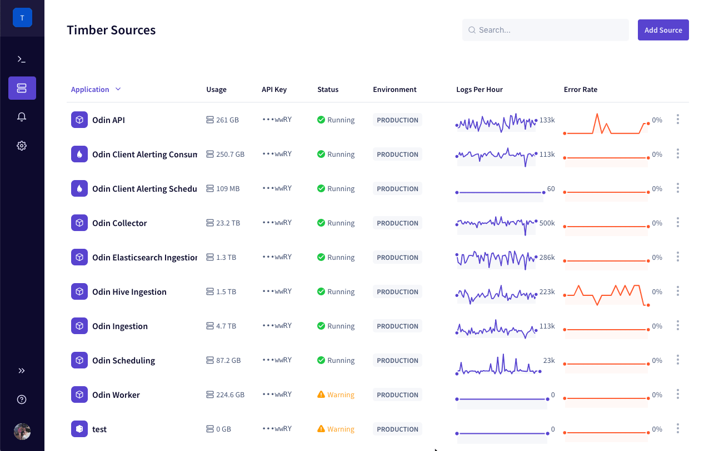
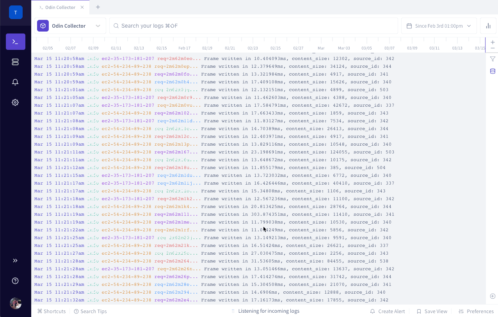
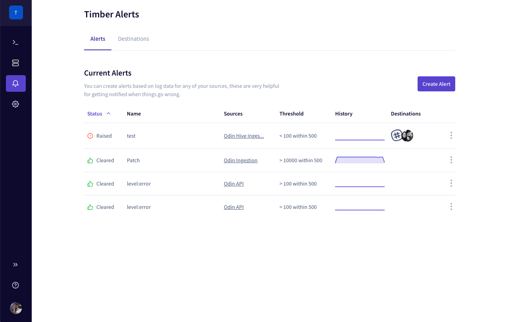
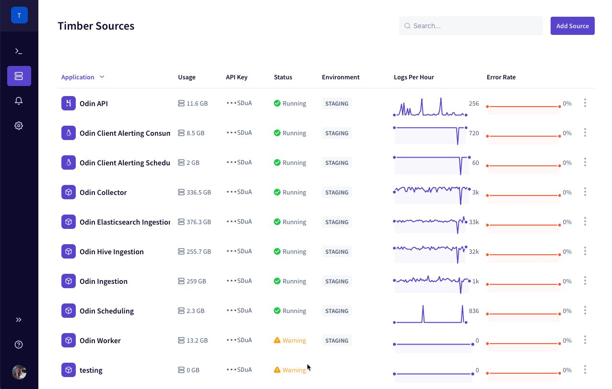
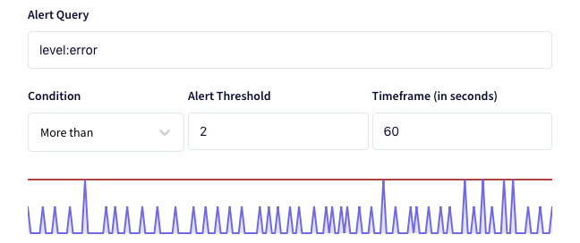
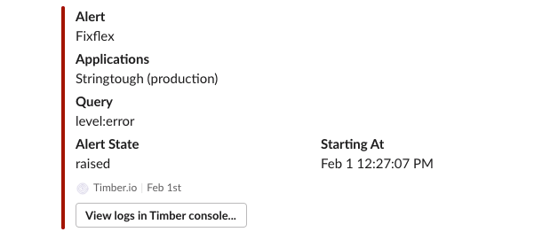
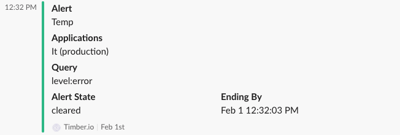
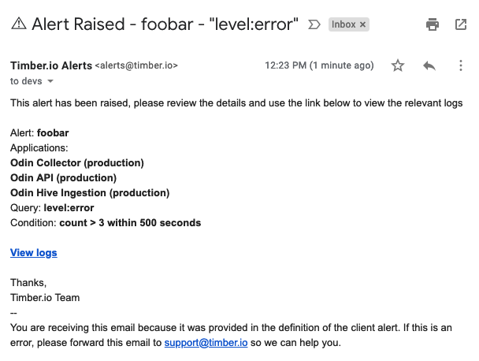
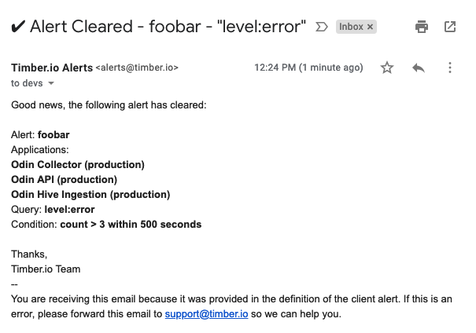

# Alerting

Timber offers powerful threshold based alerting on your log data, allowing you to be notified when certain conditions are met.

## Getting Started


**Before you begin:** Your account comes with a default "All Admin" notification destination which will send an email to all [members](account-management/team-management.md) with the [admin role](account-management/role-based-access-control.md#permissions). This is the same destination that Timber send its system notices. If you'd like to add more destinations, please see the 


1. [Open the Timber web app.](https://app.timber.io)
2. Navigate to the Alerts section using the [main navigation](../clients/web-app/#2-main-navigation).
3. Click the "Create Alert" button.
4. Fill out the form. See the [Fields section](alerting.md#fields) for field explanations.
5. Click "Save Changes"

## Usage

### Creating An Alert

There are 2 ways to create an alert within Timber:

#### Within The Alerts Section

1. [Open the Timber web app.](https://app.timber.io)
2. Navigate to the Alerts section using the [main navigation](../clients/web-app/#2-main-navigation).
3. Click the "Create Alert" button.
4. Fill out the form. See the [Fields section](alerting.md#fields) for field explanations.
5. Click "Save Changes"

#### Within The Console

1. [Open the Timber web app.](https://app.timber.io)
2. Navigate to the Console using the [main navigation](../clients/web-app/#2-main-navigation).
3. Open a new tab.
4. Enter a query as desired.
5. Click on the "Create Alert" button in the bottom right.
6. Fill out the form. See the [Fields section](alerting.md#fields) for field explanations.
7. Click "Save Changes"

### Editing An Alert

1. [Open the Timber web app.](https://app.timber.io)
2. Navigate to the Alerts section using the [main navigation](../clients/web-app/#2-main-navigation).
3. Click the "..." icon next to the alert you want to edit.
4. Adjust the [field values](alerting.md#fields).
5. Click "Save Changes"

### Adding A Slack Notification Destination

Timber can notify you of alert [state changes](alerting.md#alert-states) via Slack. Adding a Slack destination is easy:

1. [Open the Timber web app.](https://app.timber.io)
2. Navigate to the Alerts section using the [main navigation](../clients/web-app/#2-main-navigation).
3. Click the "Destinations" tab.
4. Click "Create Destination"
5. Select "Slack" for the destination type.
6. Click the[ "create a new webhook..." link](https://slack.com/apps/new/A0F7XDUAZ-incoming-webhooks).
7. Select your Slack channel and click "Add Incoming Webhooks Integration"
8. Copy the Slack webhook URL.
9. Head back to Timber and paste that URL in the "Slack Webhook URL" field.
10. Click "Save Changes".

### Adding An Email Notification Destination

1. [Open the Timber web app.](https://app.timber.io)
2. Navigate to the Alerts section using the [main navigation](../clients/web-app/#2-main-navigation).
3. Click the "Destinations" tab.
4. Click "Create Destination"

## Fields

### Name

The name of your alert, this will be used in any notifications sent. Use something shot and descriptive.

### Source

The [source\(s\)](source-management.md) of log data the alert will operate against. You can select one or more. At least one is required.

### Query

Query used to filter the alert result set. This is the same query used in the [live tailing view](live-tailing.md) and follows the same [syntax](live-tailing.md#query-syntax). To verify syntax we recommend searching within the [console / live-tail view](live-tailing.md) and then clicking the ["create alert" button in the bottom left](alerting.md#within-the-console).

### Condition / Threshold / Window

Timber implements threshold based alerting on the quantity of matching logs within the window specified. When the quantity surpasses the threshold, the alert is [`raised`](alerting.md#raised), and when it does not, the alert is [`cleared`](alerting.md#cleared). The window is checked on 60 second intervals.

As part of creating an alert Timber provides visual feedback on the quantity of logs matching your query and where the threshold lies.

You'll notice in the above:

1. Increasing the timeframe increases the quantity of logs matched. This makes sense, given more time there should naturally be more logs that match your query.
2. Increasing the threshold reduces the likelihood you alert will fire. This is a great way to rule out false positives.

See the [Reduce alert sensitivity guide](alerting.md#reduce-alert-sensitivity) for more information.

### Alert Destinations

This determines how we notify you of alert state changes. See:

* [Adding a Slack notification destination](alerting.md#adding-a-slack-notification-destination)
* [Adding an email notification destination](alerting.md#adding-an-email-notification-destination)
* [Notifications](alerting.md#notifications)

## Alert States

An alert can be in one of 2 states:

### raised

When an alert is raised it means that the result of the last [check](alerting.md#how-it-works) _exceeded_ the [condition](alerting.md#condition).

### cleared

When an alert is cleared it means that the result of the last [check](alerting.md#how-it-works) did _not exceed_ the [condition](alerting.md#condition).

## Notifications

### Notification Destinations

Timber has a concept called "notification destinations". These are the means by which we'll notify you of alert state changes \(more on that below\). See:

* [Adding a Slack notification destination](alerting.md#adding-a-slack-notification-destination)
* [Adding an email notification destination](alerting.md#adding-an-email-notification-destination)

### Slack

Timber can send notification through Slack webhooks.

#### Raised notification

#### Cleared notification

### Email Group

Timber can send alert notifications to a group of emails.

#### Raised Notification

#### Cleared Notification

### When Notifications Are Sent

Notifications are sent when an alert _changes state_, meaning you will not receive duplicate alerts if you alert remains in a [`raised` state](alerting.md#raised). This helps to reduce alert noise.

If you find that you are receiving too many notifications please see the [Reduce Alert Sensitivity guide](alerting.md#reduce-alert-sensitivity).

## Guides

### Alert on errors

To alert on error, create an alert with the following fields:

| Field | Value | Description |
| :--- | :--- | :--- |
| Name | `Errors` | The name of the alert. |
| Query | `level:error` | The query used to filter to relevant logs. |
| Condition | `More than` | The alert is raised only when it exceeds the threshold. |
| Threshold | `0` | If there is more than 0 logs matching `level:error` [raise](alerting.md#raised) it. |
| Timeframe | `300` | Evaluate the alert over 5 minute intervals. |

### Alert on 500 responses


This guide assumes you have a `http_response_sent.status` field. Please see our [language integrations](../setup/languages/) for info on how to capture this field.


| Field | Value | Description |
| :--- | :--- | :--- |
| Name | `500s` | The name of the alert. |
| Query | `http_response_sent.status:>=500` | The query used to filter to relevant logs. |
| Condition | `More than` | The alert is raised only when it exceeds the threshold. |
| Threshold | `0` | If there is more than 0 logs matching `level:error` [raise](alerting.md#raised) it. |
| Timeframe | `300` | Evaluate the alert over 5 minute intervals. |

### Alert on slow response times


This guide assumes you have a `http_response_sent.duration_ms` field. Please see our [language integrations](../setup/languages/) for info on how to capture this field.


| Field | Value | Description |
| :--- | :--- | :--- |
| Name | `500s` | The name of the alert. |
| Query | `http_response_sent.duration_ms:>=5000` | The query used to filter to relevant logs. |
| Condition | `More than` | The alert is raised only when it exceeds the threshold. |
| Threshold | `0` | If there is more than 0 logs matching `level:error` [raise](alerting.md#raised) it. |
| Timeframe | `300` | Evaluate the alert over 5 minute intervals. |

### Reduce Alert Sensitivity

The best way to reduce alert sensitivity is to increase your window size. This helps to smooth out the total. For example, if your window size is currently 60 seconds with a threshold of 1, it is much more likely your alert will raise and clear many times over the course of an hour. But if your window is 300 seconds with a threshold of 50 it helps to smooth out spikes, ensuring your alert is only raised in exceptional cases.

## How It Works

Timber simply evaluates your alert on a 60 second interval and maintains the alert state with the alert itself. If the alert threshold is crossed the alert will be set to a [`raised` state](alerting.md#raised). Then, if the threshold is crossed back the other way the alert will be set to a [`cleared` state](alerting.md#cleared). Timber will only notify you on state changes. You will not be notified on every check.

