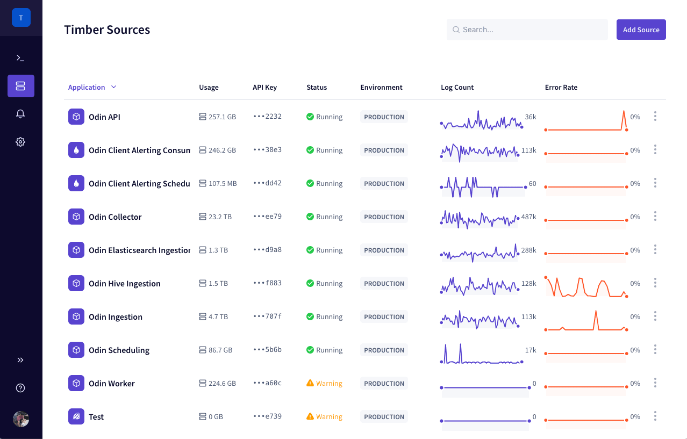
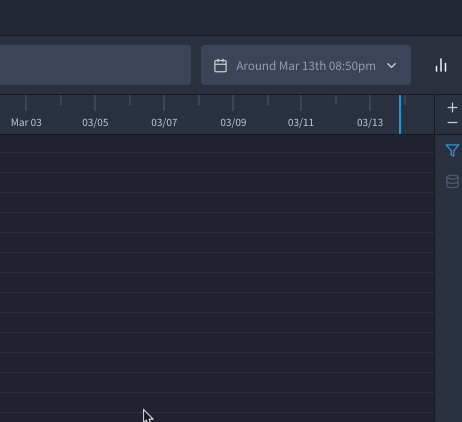
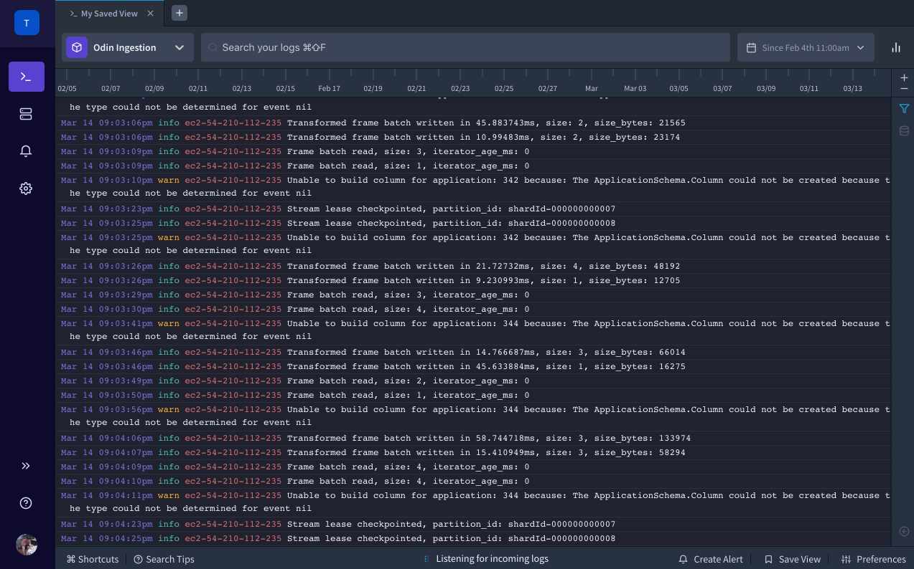
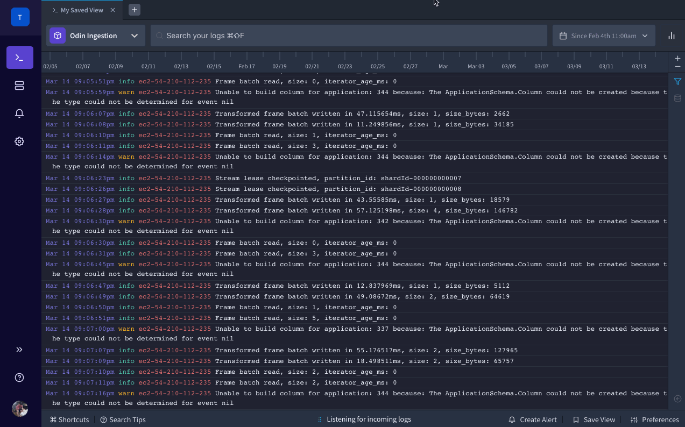
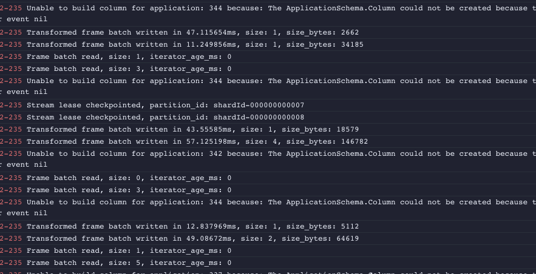
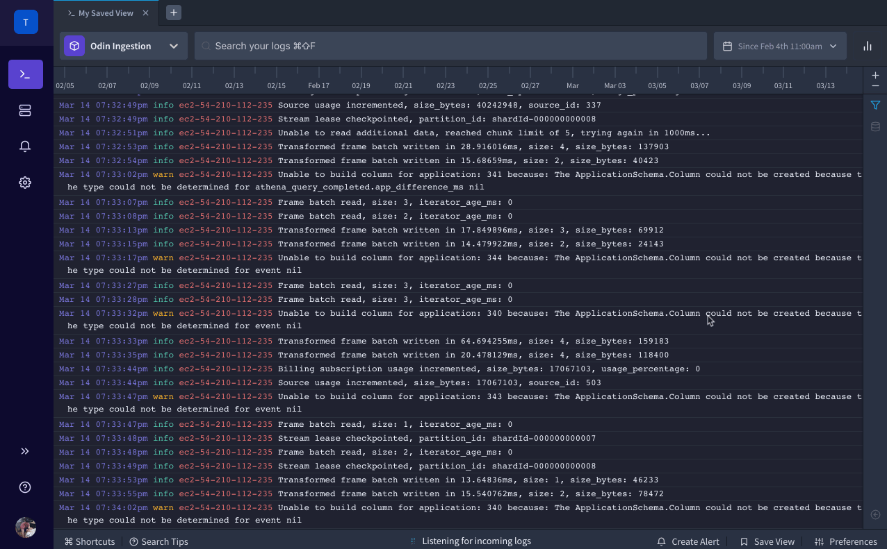
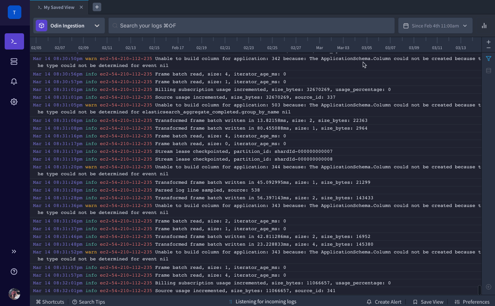

# Live Tailing & Searching

Timber's live-tail feature lets you access and search your logs in real-time. Logs will automatically appear within seconds of being sent to Timber.


This feature is designed for simple, fast, real-time access to your logs. For complex querying please see our [SQL Querying feature](sql-querying.md).


## Getting Started



1. [Open the Timber web app](https://app.timber.io).
2. Navigate to the [Console](../clients/web-app/#the-console) using the [main navigation](../clients/web-app/#2-main-navigation).
3. Select the desired source that you want to tail.
4. A new [tab](../clients/web-app/#tabs) will open and live tailing will begin automatically.
5. Optionally enter a [query](live-tailing.md#query-syntax) to filter your results.





1. [Install the `timber` CLI.](../clients/cli/#installation)
2. List your available sources:  


   ```bash
   timber sources
   ```

3. Execute the `tail` command by providing your chosen source ID:  


   ```bash
   timber tail --source-id 1234
   ```

4. Optionally specify the `--query` option to provide a [query](live-tailing.md#query-syntax) and filter your results:  


   ```bash
   timber tail --source-id 1234 --query "query"
   ```

   Type `timber help tail` for a full list of command options and `timber help` for global options. See the [CLI docs](../clients/cli/) for more information.





## Usage

### Searching

#### Query Syntax

Timber's live-tail query syntax follows a limited [Lucene style syntax](https://lucene.apache.org/core/2_9_4/queryparsersyntax.html). For more complex queries please see the [SQL Querying guide](sql-querying.md).

```text
[ [ negation ], condition ] [ delimiter ] [ ... ]
```

Where:

```ruby
negation = "!" | "-" ;
condition = { all characters - " " } | '"', { all characters }, '"' ;
delimiter = " " | "AND" | "OR" ;
all characters = ? all visible characters ? ;
```

#### Reserved Characters

Timber reserves the following characters to implement the our query syntax:

| Category | Character\(s\) | Description |
| :--- | :--- | :--- |
| Wildcards | `*` | Wildcard matching 0 or more characters |
|  | `?` | Wildcard matching _exactly_ 1 character |
| Comparison | `:` | The field on the left equals the value on the right |
|  | `:-` | The field on the left does not equal the value on the right |
|  | `:>` | The field on the left is greater than the value on the right |
|  | `:>=` | The field on the left is greater than or equal to the value on the right |
|  | `:<` | The field on the left is less than the value on the right |
|  | `:<=` | The field on the left is less than or equal to the value on the right |
| Negation | `-` | Negates the result of the following `condition` |
|  | `!` | Negates the result of the following `condition` |
| Delimiters |  `` | Space. This is an implied delimiter equivalent to using `AND` |
|  | `AND` | The `condition`s on the left and right must be true |
|  | `OR` | The `condition`s on the left or right must be true  |
| Grouping | `(`, `)` | Evaluates the following sequence of characters into a single result, must be terminated with a final `)` |
| Escaping | `\` | Escapes the following character, treating it as literal |
|  | `"`, `"` | Treats the following sequence of characters as literal, must be terminated with a final `"` |

#### Text Examples

| Example | Description |
| :--- | :--- |
| `paul bunyan` | Contain `paul` _and_ `bunyan` |
| `"paul bunyan"` | Literal search, contains the `paul bunyan` phrase exactly |
| `pau*` | Contains any word starting with `pau` followed by any number of characters |
| `pau?` | Contains any word starting with `pau` followed by 1 character |
| `pau??` | Contains any word starting with `pau` followed by 2 characters |

#### Attribute Examples

Attributes are any field you send with your log data. Nested fields accessed with a `.` delimited path:

| Example | Description |
| :--- | :--- |
| `user.name:"paul bunyan"` | The `user.name` field is equal to `paul bunyan` |
| `http_response_sent.status:>=500` | The `http_response_sent.status` field is greater than `500` |
| `http_respopnse_sent.status:-500` | The `http_response_sent.status` field does not equal `500` |

#### Operator Examples

| Example | Description |
| :--- | :--- |
| `-paul` | Does not contain `paul` |
| `!paul` | Does not contain `paul` |
| `paul AND bunyan` | Both conditions, on each side of `AND`, must evaluate to true |
| `NOT paul` | Does not contain `paul` |
| `paul OR bunyan` | One condition, on either side of `OR`, must evaluate to true |
| `(paul OR bunyan) AND ox` | Contains `paul` or `bunyan,` and `ox` |
| `-(paul OR bunyan) AND ox` | Does not contain `paul` or `bunyan,` and contains `ox` |

### Applying Date Ranges

Timber offers the ability to search within a date range. This is useful since it helps reduce noise and improves search speeds. You can use the semantic date range input or the timeline to accomplish this,.

#### Using The Date Input

In the top right of the console you'll see a clickable date input. Clicking that will open the date range input box with a singe input field:



You can enter both a range and a single date. Entering a single date will [jump to that date](live-tailing.md#jumping-to-a-date) \(more on that below\). Timber accepts a wide range of semantic date ranges and is powered by the [chrono javascript library](https://github.com/wanasit/chrono). Some examples include:

| Example | Description |
| :--- | :--- |
| `last 24 hours` | Will narrow your search to the last 24 hours. |
| `24 hours ago to now` | Will narrow your search to the last 24 hours. |
| `2019-03-02T12:00:00Z to 2019-03-04T12:00:00Z` | Will narrow your search to the exact range supplied. |

#### Using The Timeline

Additionally, Timber displays a timeline at the top of the console. This is an interactive timeline that you can use to generally select dates:


### Jumping To A Date

Similar to applying a date range, you can jump to a date using the date range picker or the timeline:

#### Using The Date Input

In the top right of the console you'll see a clickable date input. Clicking that will open the date range input box with a singe input field:


You can enter both a range and a single date. Entering a range will [apply that date range](live-tailing.md#applying-date-ranges) \(more on that above\). Timber accepts a wide range of semantic dates and is powered by the [chrono javascript library](https://github.com/wanasit/chrono). Some examples include:

| `last 24 hours` | Will narrow your search to the last 24 hours. |
| :--- | :--- |
| `2019-03-14T12:22:12.123Z` | ISO8601. Jumps to the exact date. |
| `March 2, 2019` | Jumps to March 2, 2019 at 12am. |
| `12:31pm` | Jumps to `12:31pm` \(local\) for the current day. |

#### Using The Timeline

Additionally, Timber displays a timeline at the top of the console. This is an interactive timeline that you can use to generally select dates. Simply click on the timeline to jump to that date:


### Faceting

Facets provide a high-level overview of your log data. It's a great place to start if you need to quickly narrow by specific facets. To view available facets simply click on the facet icon on the right side of the console:



### Saving Searches / Views

Head over to the [saved views section](saved-views.md) for a comprehensive guide.

### Viewing Context / Metadata

Timber displays your line in a human readable format. This makes using and reading your logs much easier, but many times you need to view the metadata / context attached to the log line. You can achieve this by clicking on the "eye" icon next to each line.


When you view context for a line the URL updates creating a unique link to that log. If you send that URL to a colleague thy will also see the log's metadata / context.




### Linking To A Log / Sharing

You can link directly to a log for easy sharing. Next to each log is a "link" icon that will copy it's URL to your clipboard. When you send a link to someone the console will open with that log's context / metadata open.



## Configuration

Main console preferences are available by click on the "preferences" button in the bottom right. Your preferences are saved as they're changed and will be remembered if you leave and come back.



### Themes

Timber offers both a light and a dark themes. Your chosen theme will be used across the entire console, they are not view specific.



### Line Styling

You can customize the font size, weight, line height, wrapping, and more in the line style tab

### Time Zones

### Log Line Format


## 


