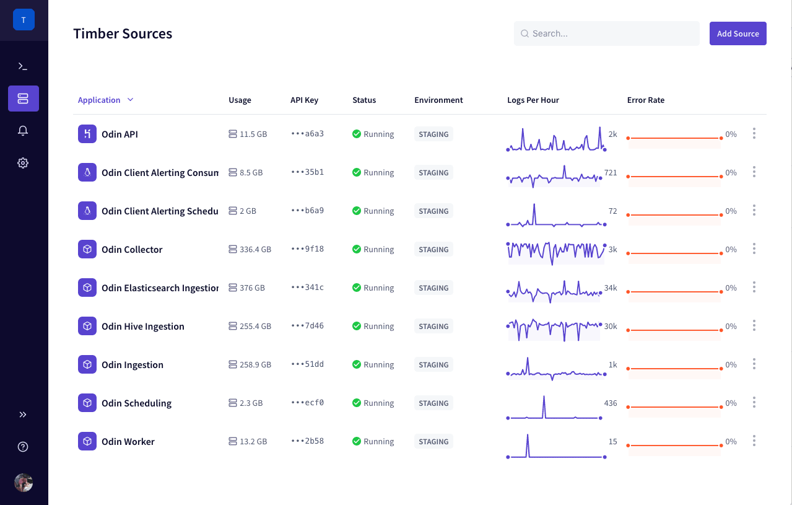
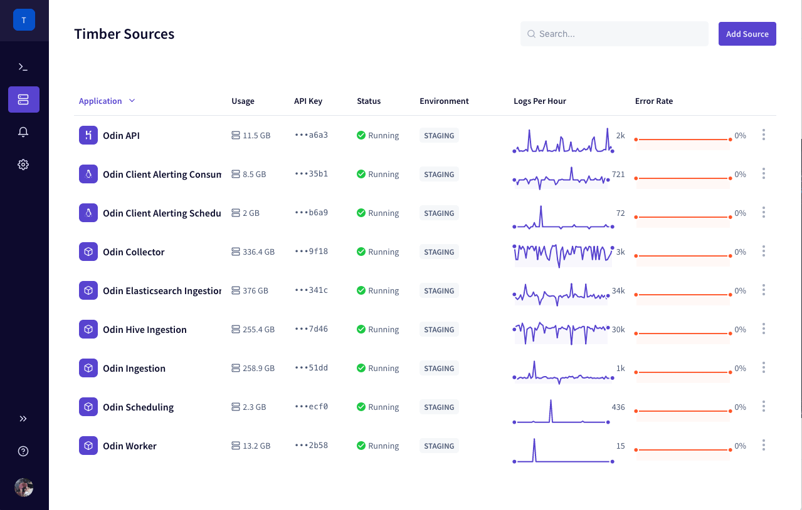

# Saved Views

The Timber console implements a tab based interface, allowing you save tabs as "views", making it quick and easy to load previously saved views.

## Getting Started

[Open the Timber web app.](https://app.timber.io)

1. Navigate to the Console using the [main navigation](../clients/web-app/#2-main-navigation).
2. Open a new tab and customize it as you please, such as [entering a search query](live-tailing.md#query-syntax), [changing the line format](live-tailing.md#changing-the-log-line-format), and [more](live-tailing.md).
3. In the bottom right of the interface click "Save View".



## Usage

### Loading A View



1. [Open the Timber web app](https://app.timber.io).
2. Navigate to the [Console](../clients/web-app/#the-console) using the [main navigation](../clients/web-app/#2-main-navigation).
3. Open a new tab.
4. In the second column you'll see a list of saved views.
5. Select the view to load it.





1. [Install the `timber` CLI.](../clients/cli/#installation)
2. List your available views:  


   ```bash
   timber views
   ```

3. Execute the `tail` command by providing your chosen view ID:  


   ```bash
   timber tail --view-id [view_id]
   ```



### Updating A View

1. Load your saved view
2. Make changes to your view as necessary.
3. Re-save the view using by clicking "Save View" in the bottom right.

### Deleting A View

1. Navigate to the Console using the [main navigation](../clients/web-app/#2-main-navigation).
2. Open a new tab.
3. In the second column you'll see a list of saved views. Click the trash can icon to delete it.

## How It Works

When you save a view you're saving all of the parameters of your view:

* The sources being searched
* [The current query](live-tailing.md#query-syntax)
* The date range / live-tail status
* [The log line format](live-tailing.md#changing-the-log-line-format)

